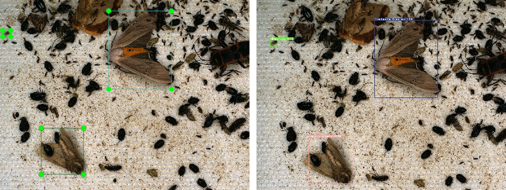

# Yolo-Pest: Insect Pest Object Detection Algorithm via CAC3 Module

**🎉Yolo-Pest finished the game with a leading mAP.5 of **_91.9%_** on [10th Teddy Cup Question A](https://www.tipdm.org:10010/#/competition/1481159137780998144/question), wining the national first prize.🎉**

## 📖How to use
### 📚Dataset
Download dataset from [the official website of the Teddy Cup](http://www.semantic-kitti.org/dataset.html#download) (including **training image of 28 species of pests** and **label data**).

Download IP102 from [IP102](https://github.com/%20xpwu%2095/IP102) (including **more than 75,000 training image of 102 kinds of pests** and **label data**).

After downloading the dataset, the format of the labels needs to be processed into the yolo format.
```
0 0.96501 0.9  0.0733788 0.1
0 0.35401 0.2  0.0045253 0.5
...
```
You also need a classes.txt in the same folder to display the label name.
```text
Sesamia inferens
Chilo suppressalis
Rice leaf roller
...
```
After downloading the dataset, check that the path is correct before running.

The structure of the folders in the entire dataset is as follows:
```
DATAROOT
└── IP102
    ├── images
    │   ├── trains
    │   │   ├──IP000000002.jpg
    │   │   ├──...
    │   ├── vals
    │   │   ├──IP000000000.jpg
    │   │   ├──...
    └──labels
    │   ├── trains
    │   │   ├──IP000000002.txt
    │   │   ├──classes.txt
    │   │   ├──...
    │   ├── vals
    │   │   ├──IP000000000.txt
    │   │   ├──classes.txt
    │   │   ├──...
   ...
```
Enter the address and label name of your data set in the [insect.yaml](data/insect.yaml) which ensure that the dataset is used during the training process.


### 💾Environment
Our environment: Ubuntu 18.04, CUDA 11.2 

Use conda to create the conda environment and activate it:
```shell
conda env create --name your_env_name python=3.8
conda activate your_env_name
pip install -r requirements.txt
```
### 📈Training
Check the path in [train.py](./train.py), and run it to train:
```shell
python3 train.py 
```
You can change the parameter from line 430 in [train.py](./train.py) to get an improved performance.
```text
parser.add_argument('--weights', type=str, help='initial weights path')
parser.add_argument('--cfg', type=str, help='model.yaml path')
parser.add_argument('--data', type=str, help='dataset.yaml path')
parser.add_argument('--hyp', type=str, help='hyperparameters path')
parser.add_argument('--epochs', type=int, help='total training epochs')
parser.add_argument('--batch-size', type=int, help='total batch size for all GPUs, -1 for autobatch')
...
```
### 📝Validation and Evaluation
Check the path in [val.py](./val.py).

Then, run it to get the predicting results and IoU in paper separately(It will run after each epoch by default during training
):
```shell
python3 val.py
```
### 👀Visualization
Use tensorboard to visualization
```shell
pip install tensorboard
tensorboard --logdir my_log
```


## 👏Acknowledgment
This repo is based on [Yolov5](https://github.com/ultralytics/yolov5), and we are very grateful for their excellent work.


